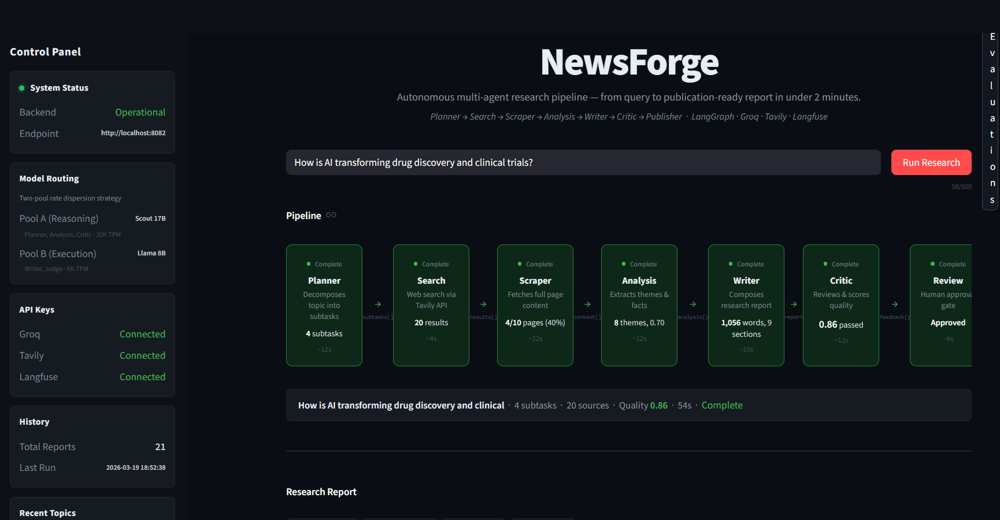

# NewsForge — Multi-Agent Research Pipeline

Autonomous research pipeline built with LangGraph. Takes any topic and produces a structured, cited research report in ~65 seconds.

**Stack:** LangGraph · Groq · Tavily · Langfuse · FastAPI · Streamlit · Docker

**[Demo video](https://youtu.be/-6d8ArcSwgw)**



---

## What it does

Runs a 7-agent pipeline end to end:

```
Planner → Search → Scraper → Analysis → Writer → Critic → Publisher
                                              ↑         |
                                              └─ revise ─┘   (max 2 loops)
                                                    |
                                             Human Review   ← LangGraph interrupt()
                                            /             \
                                       Approved          Rejected
                                           |
                                       Publisher
```

- **Planner** — ReAct loop decomposes the topic into prioritized subtasks (Scout 17B)
- **Search** — parallel Tavily queries via `asyncio.gather` (5x speedup over sequential)
- **Scraper** — httpx + BeautifulSoup, ~74% success rate, graceful fallback chain
- **Analysis** — ReAct loop for cross-source theme/fact/contradiction extraction (Scout 17B)
- **Writer** — single-shot structured markdown report generation (Llama 8B)
- **Critic** — quality rubric scoring (0–1); loops back to Writer if score < 0.70 (Scout 17B)
- **Publisher** — saves `.md` report + JSON metadata locally; optional AWS S3 + DynamoDB

---

## Architecture decisions

**LangGraph over LangChain chains.** The Critic→Writer revision loop requires cycles via conditional edges — impossible in linear chains. LangGraph's `StateGraph` handles it natively.

**State schema as the data contract.** Designed the `TypedDict` for all 7 agents before writing any agent code. `Annotated[list, operator.add]` prevents concurrent writes from overwriting accumulated fields. Every field is an explicit contract between producer and consumer agents.

**ReAct only where it adds value.** Planner needs iterative self-correction to evaluate coverage quality. Analysis needs refinement loops for cross-source synthesis. Writer is intentionally single-shot — structured generation doesn't benefit from ReAct.

**SQLite checkpointing from day one.** Every node's output is persisted via LangGraph's `SqliteSaver`. If a benchmark run crashes mid-way due to rate limits, it resumes from the last successful node — not from scratch.

**Non-blocking API with polling.** `POST /research` returns a `research_id` immediately; the frontend polls `/status` every second. Same pattern as OpenAI batch and Anthropic async APIs. The original synchronous design caused 60–100s HTTP hangs.

**Two-pool model routing.** Each pool has independent Groq rate limits. Pool A (Scout 17B, 30K TPM) handles all reasoning-heavy agents. Pool B (Llama 8B, 6K TPM) handles structured generation. Critic was moved from Pool B to Pool A after Writer + Critic back-to-back exceeded Pool B's TPM limit.

**LLM-as-judge separate from Critic.** Critic is an internal quality gate (coherence, citations, structure). The benchmark judge is an external evaluation (research depth, source diversity, topic coverage). These are orthogonal — Critic scored 0.85 on reports that Judge scored 7.5. Both metrics are needed.

---

## Benchmark results

10 topics evaluated by an independent LLM judge (llama-3.1-8b-instant, temp 0.1) across 5 dimensions: Research Depth, Source Diversity, Topic Coverage, Factual Coherence, Report Quality.

| Topic | Difficulty | Score | Time |
|---|---|---|---|
| Impact of AI on healthcare 2025 | medium | 8.2 | 31s |
| Climate change coastal cities | medium | 8.8 | 76s |
| State of quantum computing 2025 | hard | 8.3 | 63s |
| Economic impact of remote work | easy | 8.6 | 58s |
| CRISPR gene editing 2025 | hard | 8.2 | 69s |
| Cryptocurrency regulation globally | medium | 7.5 | 48s |
| Mental health crisis Gen Z | easy | 8.8 | 67s |
| Supply chain resilience post-COVID | easy | 7.6 | 93s |
| Fusion energy viability | hard | 7.5 | 62s |
| Social media algorithm polarization | medium | 7.8 | 86s |

**10/10 passing · 8.1/10 avg score · 65s avg · 74% scrape rate**

Hard topics averaged 7.9 vs easy 8.3 — graceful degradation, not a cliff drop. Revision loop fired on 2 topics and improved scores (Supply chain: 0.64 → revision → 0.90).

---

## Quick start

**Prerequisites:** Python 3.11+, API keys for Groq, Tavily, and Langfuse

```bash
git clone https://github.com/adityaab1407/newsforge-multi-agent
cd newsforge-multi-agent

python -m venv .multi_agent
source .multi_agent/bin/activate  # Windows: .multi_agent\Scripts\activate

pip install -r requirements.txt

cp .env.example .env
# Fill in GROQ_API_KEY, TAVILY_API_KEY, LANGFUSE_PUBLIC_KEY, LANGFUSE_SECRET_KEY

uvicorn backend.main:app --reload --port 8082
# new terminal:
streamlit run frontend/app.py --server.port 8502
```

**With Docker:**

```bash
docker compose up --build
# Backend:  http://localhost:8082/docs
# Frontend: http://localhost:8502
```

---

## API keys

| Service | Purpose | Free tier |
|---|---|---|
| [Groq](https://console.groq.com/keys) | LLM inference | 500K tokens/day |
| [Tavily](https://app.tavily.com/home) | Web search | 1000 searches/month |
| [Langfuse](https://cloud.langfuse.com) | Observability traces | Unlimited (free tier) |

Use a dedicated API key per project to keep rate limits and usage isolated.

---

## Model routing

| Pool | Model | TPM | Agents |
|---|---|---|---|
| A — Reasoning | llama-4-scout-17b-16e-instruct | 30K | Planner, Analysis, Critic |
| B — Execution | llama-3.1-8b-instant | 6K | Writer, Judge |

A full 10-topic benchmark uses ~102K tokens on Pool A and ~80K on Pool B — well under the 500K/day free limits.

---

## Project structure

```
├── agents/
│   ├── planner.py       # ReAct loop — topic decomposition
│   ├── search.py        # Tavily async parallel search
│   ├── scraper.py       # httpx + BeautifulSoup content extraction
│   ├── analysis.py      # ReAct loop — theme/fact/contradiction extraction
│   ├── writer.py        # Structured markdown report generation
│   ├── critic.py        # Quality scoring + revision trigger
│   └── publisher.py     # Local save + optional AWS S3/DynamoDB
├── orchestrator/
│   ├── state.py         # NewsForgeState TypedDict — shared state schema
│   ├── graph.py         # 7-node StateGraph with conditional edges
│   └── checkpointer.py  # SQLite persistence for crash recovery
├── backend/
│   ├── main.py          # FastAPI — non-blocking endpoints + polling
│   └── schemas.py       # Pydantic V2 request/response models
├── frontend/
│   └── app.py           # Streamlit UI — pipeline viz + HITL review
├── evaluation/
│   ├── benchmark_topics.py  # 10 topics with difficulty ratings
│   ├── judge.py             # LLM-as-judge evaluator
│   └── benchmark_runner.py  # Full benchmark orchestration
├── config/
│   └── settings.py      # Centralized config + model routing
├── tests/               # Unit + integration tests
├── docker-compose.yml
├── Makefile
└── requirements.txt
```

---

## API endpoints

| Method | Endpoint | Description |
|---|---|---|
| `POST` | `/research` | Start pipeline — returns `research_id` immediately |
| `GET` | `/research/{id}/status` | Poll status: `running` / `awaiting_approval` / `complete` / `failed` |
| `POST` | `/research/{id}/approve` | Resume HITL — runs Publisher |
| `POST` | `/research/{id}/reject` | Resume HITL — ends pipeline without publishing |
| `GET` | `/health` | Backend health check |

---

## Running tests

```bash
pytest tests/ -v

# Integration test (requires live API keys)
pytest tests/test_integration.py -v
```

## Running the benchmark

```bash
# Full 10-topic run
python evaluation/benchmark_runner.py --topics 10

# Quick 3-topic run (safe within free tier limits)
python evaluation/benchmark_runner.py --topics 3

# View results from last run
python evaluation/benchmark_runner.py --summary-only
```

Results saved to `data/benchmark_results/` as JSON, CSV, and HTML.

---

## Known limitations

**Scraper 74% success rate.** httpx can't bypass JS-rendered pages, paywalls, or bot detection. Production fix: Jina Reader API or Firecrawl (~95% success).

**Analysis binary encoding.** Llama 4 Scout occasionally returns compressed binary data on prompts with mixed-encoding academic content. Mitigated with an 8K char corpus limit and binary response detection. Production fix: pre-clean with Jina Reader, or switch to llama-3.3-70b for Analysis.

**In-memory run tracking.** The `active_runs` dict in FastAPI is lost on server restart. Production fix: Redis or PostgreSQL.

**Groq free tier.** Two-pool routing keeps a full benchmark run under 20% of the daily token budget, but concurrent use across multiple users would exhaust it quickly. Production: paid tier or dedicated keys.

---

## Roadmap

- **WebSocket streaming** — replace polling with real-time pipeline events
- **Jina Reader integration** — improve scraper success rate from ~74% to ~95%
- **RAG over past reports** — vector search with Qdrant for cross-report synthesis
- **PostgreSQL checkpointer** — replace SQLite for multi-instance deployments
- **MCP server wrappers** — expose agents as tool-use protocol tools
- **Visual agent** — chart generation from Analysis output

---

Built by [Aditya](https://github.com/adityaab1407)

