# NewsForge — Multi-Agent Research Pipeline

Autonomous research pipeline using 7 LangGraph agents that researches any topic and produces a structured report in ~65 seconds.

Built with LangGraph (state machine orchestration), Groq (LLM inference), Tavily (web search), and Langfuse (observability). Features a Critic→Writer revision loop, Human-in-the-Loop approval via LangGraph `interrupt()`, and a 10-topic LLM-as-judge benchmark.

## What Works

- **7-agent LangGraph pipeline** running end to end — Planner → Search → Scraper → Analysis → Writer → Critic → Publisher
- **Deep ReAct loops** on Planner (coverage self-assessment) and Analysis (cross-source synthesis)
- **Critic→Writer revision loop** via LangGraph conditional edges — reports revised until quality threshold met
- **Human-in-the-Loop** with LangGraph `interrupt()` — pipeline pauses for approval before publishing
- **Async parallel search** — 5 Tavily queries via `asyncio.gather` (5x speedup over sequential)
- **Two-pool model routing** — rate dispersion across Scout 17B (30K TPM) and Llama 8B (6K TPM)
- **SQLite checkpointing** — pipeline resumes from last successful node after crash or rate limit
- **Langfuse observability** — per-agent traces with nested spans and pipeline events
- **FastAPI backend** — non-blocking POST /research with background thread + polling architecture
- **Streamlit frontend** — live pipeline visualization with agent state cards and HITL review panel
- **10-topic benchmark** — 10/10 passing, 8.1/10 avg score, LLM-as-judge evaluation

## Architecture

```mermaid
graph TD
    A[User Topic] --> B["Planner<br/>ReAct Loop<br/>Groq Scout 17B"]
    B -->|subtasks| C["Search<br/>Tavily Async<br/>5 parallel queries"]
    C -->|results| D["Scraper<br/>httpx + BS4<br/>~74% success"]
    D -->|content| E["Analysis<br/>ReAct Loop<br/>Groq Scout 17B"]
    E -->|themes| F["Writer<br/>Structured Gen<br/>Groq 8B"]
    F -->|draft| G["Critic<br/>Quality Score<br/>Groq Scout 17B"]
    G -->|"score < 0.70"| F
    G -->|"score >= 0.70"| H["Human Review<br/>LangGraph Interrupt"]
    H -->|approved| I["Publisher<br/>Local Save"]
    H -->|rejected| J["Not Published"]

    style B fill:#1e3a5f
    style E fill:#1e3a5f
    style G fill:#1e3a5f
    style H fill:#5f3a1e
```



**Key architectural choices:**
- **LangGraph over LangChain chains** — revision loop requires cycles (conditional edges), which are impossible in linear chains
- **State schema designed upfront** — `TypedDict` with `Annotated[list, operator.add]` for accumulating fields, `Optional` for replaced fields. Every field is a data contract between two agents
- **Non-blocking API** — POST /research returns immediately, frontend polls /status every 2s. Same pattern as OpenAI batch and Anthropic async APIs

## Benchmark Results

10 topics evaluated by an independent LLM judge (llama-3.1-8b-instant, temp 0.1) scoring on 5 dimensions: Research Depth, Source Diversity, Topic Coverage, Factual Coherence, Report Quality.

| Topic                               | Difficulty | Score | Time |
|-------------------------------------|-----------|-------|------|
| Impact of AI on healthcare 2025     | medium    | 8.2   | 31s  |
| Climate change coastal cities       | medium    | 8.8   | 76s  |
| State of quantum computing 2025    | hard      | 8.3   | 63s  |
| Economic impact of remote work      | easy      | 8.6   | 58s  |
| CRISPR gene editing 2025           | hard      | 8.2   | 69s  |
| Cryptocurrency regulation globally  | medium    | 7.5   | 48s  |
| Mental health crisis Gen Z          | easy      | 8.8   | 67s  |
| Supply chain resilience COVID-19    | easy      | 7.6   | 93s  |
| Fusion energy viability             | hard      | 7.5   | 62s  |
| Social media algorithm polarization | medium    | 7.8   | 86s  |

**Overall: 10/10 passing | 8.1/10 avg | 65s avg | 74% scrape rate**

Hard topics scored 7.9 vs easy 8.3 — graceful degradation, not cliff drop. Revision loop fired on 2 topics and improved quality (Supply chain: Critic 0.64 → revision → 0.90). Analysis agent had binary encoding failures on 5/10 topics; Writer + Critic loop compensated — all 10 still passed.

## Quick Start

**Prerequisites:** Python 3.11+, Git, API keys (Groq, Tavily, Langfuse)

```bash
# 1. Clone
git clone https://github.com/adityaab1407/newsforge-multi-agent
cd newsforge-multi-agent

# 2. Create virtual environment
python -m venv .multi_agent
source .multi_agent/bin/activate  # Linux/WSL
# .multi_agent\Scripts\activate   # Windows

# 3. Install dependencies
pip install -r requirements.txt

# 4. Configure environment
cp .env.example .env
# Edit .env with your API keys

# 5. Start backend
uvicorn backend.main:app --reload --port 8080

# 6. Start frontend (new terminal)
streamlit run frontend/app.py

# 7. Open http://localhost:8501
```

**Or with Docker:**

```bash
docker-compose up --build
# Backend: http://localhost:8080/docs
# Frontend: http://localhost:8501
```

## API Keys Required

| Service  | Purpose              | Free Tier               | Link                                    |
|----------|----------------------|-------------------------|-----------------------------------------|
| Groq     | LLM inference        | 500K tokens/day         | https://console.groq.com/keys           |
| Tavily   | Web search API       | 1000 searches/month     | https://app.tavily.com/home             |
| Langfuse | Observability traces | Unlimited (free tier)   | https://cloud.langfuse.com              |

Use dedicated API keys per project to keep rate limits and usage tracking isolated.

## Model Routing

Two-pool strategy for rate dispersion — each pool has independent Groq rate limits:

| Pool | Model | TPM Limit | Agents | Rationale |
|------|-------|-----------|--------|-----------|
| A — Reasoning | llama-4-scout-17b | 30K TPM | Planner, Analysis, Critic | Large ReAct prompts need high TPM headroom |
| B — Execution | llama-3.1-8b-instant | 6K TPM | Writer, Judge | Structured generation fits under 6K TPM |

Critic was moved from Pool B to Pool A because Writer (5500t) + Critic (2500t) exceeded Pool B's 6K TPM limit. Scout's 30K TPM handles all reasoning agents cleanly. Token budget per 10-topic benchmark: Pool A ~102K/500K TPD (20%), Pool B ~80K/500K TPD (16%).

## Design Decisions

**LangGraph over LangChain chains.** Chains are linear. The Critic→Writer revision loop requires cycles via conditional edges — impossible in chains. LangGraph's `StateGraph` supports cycles natively, which is also why it's used by production agentic systems.

**State schema as architecture document.** Designed the `TypedDict` for all 7 agents before writing any agent code. `Annotated[list, operator.add]` means concurrent writes append instead of overwrite. Every field is a contract between producer and consumer agents. Changed this approach after a previous RAG project where state was an afterthought and required rewrites.

**ReAct only where it adds value.** Planner needs iterative self-correction to evaluate coverage quality. Analysis needs refinement loops for cross-source synthesis. Writer does NOT need it — structured generation is one-shot by nature. Using ReAct everywhere would be over-engineering.

**SQLite checkpointing from day one.** Previous RAG project: rate limits hit mid-run, restarted from scratch, lost 45 minutes. NewsForge: built checkpointer on day 1. Benchmark crashed 3 times during development — resumed each time from the last successful node.

**LLM-as-judge separate from Critic.** Critic is an internal quality gate (structure, citations, coherence). Judge is an external evaluation (research depth, source diversity, coverage). These are orthogonal — Critic consistently scored 0.85 on reports that Judge scored 7.5. Both metrics are needed.

**Non-blocking API with polling.** Original design blocked for 60-100 seconds. HTTP timeout = frontend freezes. Background thread + polling mirrors every production AI API (OpenAI batch, Anthropic async).

## Project Structure

```
newsforge-multi-agent/
├── agents/                 # 7 agent implementations
│   ├── planner.py          # ReAct loop — decomposes topic into subtasks (Pool A)
│   ├── search.py           # Tavily async fan-out — parallel web search
│   ├── scraper.py          # httpx + BeautifulSoup — full-page content extraction
│   ├── analysis.py         # ReAct loop — theme/fact/contradiction extraction (Pool A)
│   ├── writer.py           # Structured markdown report generation (Pool B)
│   ├── critic.py           # Quality rubric scoring + revision trigger (Pool A)
│   └── publisher.py        # Local save + optional AWS S3/DynamoDB
├── orchestrator/           # Pipeline wiring
│   ├── state.py            # NewsForgeState TypedDict — shared state schema
│   ├── graph.py            # 7-node StateGraph with conditional edges
│   └── checkpointer.py     # SQLite persistence for crash recovery
├── backend/                # API layer
│   ├── main.py             # FastAPI — non-blocking + polling endpoints
│   └── schemas.py          # Pydantic V2 request/response models
├── frontend/
│   └── app.py              # Streamlit UI — pipeline viz + HITL review
├── evaluation/             # Benchmark system
│   ├── benchmark_topics.py # 10 topics with difficulty ratings
│   ├── judge.py            # LLM-as-judge evaluator (Pool B)
│   └── benchmark_runner.py # Orchestrates full benchmark runs
├── config/
│   └── settings.py         # Centralized config + model routing
├── utils/
│   └── llm_utils.py        # LLM response sanitization
├── scripts/
│   └── cleanup_data.py     # Data directory cleanup utility
├── tests/                  # Unit + integration tests
├── docker-compose.yml      # Backend + Frontend containers
├── Makefile                # Common dev commands
└── requirements.txt        # Pinned dependencies
```

## Running Tests

```bash
# All tests
pytest tests/ -v

# Integration test (requires API keys)
pytest tests/test_integration.py -v

# Specific agent
pytest tests/test_critic.py -v
```

## Running the Benchmark

```bash
# Full 10-topic benchmark
python evaluation/benchmark_runner.py --topics 10

# Quick 3-topic run (stays under free tier limits)
python evaluation/benchmark_runner.py --topics 3

# View results from last run
python evaluation/benchmark_runner.py --summary-only
```

Results are saved to `data/benchmark_results/` as JSON, CSV, and HTML.

## Tech Stack

| Component      | Technology                                   |
|----------------|----------------------------------------------|
| Orchestration  | LangGraph StateGraph                         |
| LLM Pool A     | meta-llama/llama-4-scout-17b-16e-instruct    |
| LLM Pool B     | llama-3.1-8b-instant                         |
| Web Search     | Tavily API (async parallel)                  |
| Scraping       | httpx + BeautifulSoup4                       |
| Observability  | Langfuse v3                                  |
| Persistence    | SQLite checkpointer (LangGraph native)       |
| Backend        | FastAPI (non-blocking + polling)              |
| Frontend       | Streamlit                                    |
| Evaluation     | LLM-as-judge (10-topic benchmark)            |
| Validation     | Pydantic V2                                  |
| Containers     | Docker + Docker Compose                      |

## Known Limitations

**Scraper 74% success rate.** httpx is blocked by JS-rendered pages, paywalls, and bot detection. BeautifulSoup fallback chain (article → main → div.content → body) helps but can't bypass JavaScript. Production fix: Jina Reader API or Firecrawl (~95% success).

**Analysis binary encoding.** Llama 4 Scout occasionally returns compressed binary data on prompts containing mixed-encoding academic content. Partially mitigated via 8K corpus limit per iteration. Production fix: pre-clean with Jina Reader before passing to Analysis, or use llama-3.3-70b-versatile.

**Groq free tier limits.** 100K TPD on versatile models exhausts in ~12 pipeline runs. Two-pool routing across 500K TPD models keeps a full 10-topic benchmark under 20% budget. Production: dedicated API keys or paid tier.

**In-memory run tracking.** `active_runs` dict in FastAPI is lost on server restart. Production fix: Redis or PostgreSQL for active run state.

## Roadmap

| Feature | Description | Status |
|---------|-------------|--------|
| Playwright scraper | JS-rendered page support | Optional dep, integrated |
| S3 + DynamoDB publisher | Cloud persistence | Implemented, needs AWS keys |
| WebSocket streaming | Real-time pipeline events | Planned |
| MCP server wrappers | Tool-use protocol integration | Planned |
| RAG with Qdrant | Vector search over past reports | Planned |
| Visual agent | Chart generation from analysis | Planned |

---

Built by [Aditya](https://github.com/adityaab1407) — LangGraph + Groq + Tavily + Langfuse
